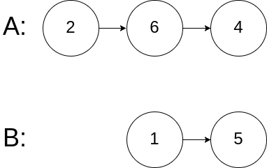

# 相交链表
Given the heads of two singly linked-lists headA and headB, return the node at which the two lists intersect. If the two linked lists have no intersection at all, return null.

For example, the following two linked lists begin to intersect at node c1:


The test cases are generated such that there are no cycles anywhere in the entire linked structure.

Note that the linked lists must retain their original structure after the function returns.

Custom Judge:

The inputs to the judge are given as follows (your program is not given these inputs):

intersectVal - The value of the node where the intersection occurs. This is 0 if there is no intersected node.

listA - The first linked list.

listB - The second linked list.

skipA - The number of nodes to skip ahead in listA (starting from the head) to get to the intersected node.

skipB - The number of nodes to skip ahead in listB (starting from the head) to get to the intersected node.

The judge will then create the linked structure based on these inputs and pass the two heads, headA and headB to your program. If you correctly return the intersected node, then your solution will be accepted.


 

**Example** 1:


**Input**: `intersectVal = 8, listA = [4,1,8,4,5], listB = [5,6,1,8,4,5], skipA = 2, skipB = 3`
**Output**: `Intersected at '8'`

Explanation: The intersected node's value is 8 (note that this must not be 0 if the two lists intersect).
From the head of A, it reads as [4,1,8,4,5]. From the head of B, it reads as [5,6,1,8,4,5]. There are 2 nodes before the intersected node in A; There are 3 nodes before the intersected node in B.
- Note that the intersected node's value is not 1 because the nodes with value 1 in A and B (2nd node in A and 3rd node in B) are different node references. In other words, they point to two different locations in memory, while the nodes with value 8 in A and B (3rd node in A and 4th node in B) point to the same location in memory.

**Example** 2:


**Input**: `intersectVal = 2, listA = [1,9,1,2,4], listB = [3,2,4], skipA = 3, skipB = 1`
**Output**: `Intersected at '2'`

Explanation: The intersected node's value is 2 (note that this must not be 0 if the two lists intersect).
From the head of A, it reads as [1,9,1,2,4]. From the head of B, it reads as [3,2,4]. There are 3 nodes before the intersected node in A; There are 1 node before the intersected node in B.

**Example** 3:



**Input**: `intersectVal = 0, listA = [2,6,4], listB = [1,5], skipA = 3, skipB = 2`
**Output**: `No intersection`
Explanation: From the head of A, it reads as [2,6,4]. From the head of B, it reads as [1,5]. Since the two lists do not intersect, intersectVal must be 0, while skipA and skipB can be arbitrary values.
Explanation: The two lists do not intersect, so return null.
 

**Constraints**:

- `The number of nodes of listA is in the m.`
- `The number of nodes of listB is in the n.`
- `1 <= m, n <= 3 * 104`
- `1 <= Node.val <= 105`
- `0 <= skipA < m`
- `0 <= skipB < n`
- `intersectVal is 0 if listA and listB do not intersect.`
- `intersectVal == listA[skipA] == listB[skipB] if listA and listB intersect.`
 

Follow up: Could you write a solution that runs in O(m + n) time and use only O(1) memory?

## 查表法

```C++
/**
 * Definition for singly-linked list.
 * struct ListNode {
 *     int val;
 *     ListNode *next;
 *     ListNode(int x) : val(x), next(NULL) {}
 * };
 */
class Solution {
public:
    ListNode* getIntersectionNode(ListNode* headA, ListNode* headB) {
        auto currentA{headA};
        auto currentB{headB};
        unordered_set<ListNode*> listNodesA;
        unordered_set<ListNode*> listNodesB;

        while (currentA != NULL || currentB != NULL) {
            if (currentB != NULL && listNodesA.count(currentB) > 0) {
                return currentB;
            }
            if (currentA != NULL && listNodesB.count(currentA) > 0) {
                return currentA;
            }
            if (currentA == currentB){
                return currentA;
            }
            listNodesA.emplace(currentA);
            listNodesB.emplace(currentB);
            if (currentA != NULL) {
                currentA = currentA->next;
            }
            if (currentB != NULL) {
                currentB = currentB->next;
            }
        }
        return NULL;
    }
};
```
A，B分别维护一个unordered_set，再去查表，注意**他俩当前就相同时，直接返回即可**
### 评估
时间复杂度 O(min(m,n))

空间复杂度 O(max(m,n))
### 知识点
- unordered_map插值可以用insert或者emplace, emplace是就地构造
- unordered_map查找是否有元素可以用count进行查找
### 优化方案
题目进阶要求 时间复杂度O(m+n),空间复杂度O(1)

## 双指针法
```C++
/**
 * Definition for singly-linked list.
 * struct ListNode {
 *     int val;
 *     ListNode *next;
 *     ListNode(int x) : val(x), next(NULL) {}
 * };
 */
class Solution {
public:
    ListNode* getIntersectionNode(ListNode* headA, ListNode* headB) {
        auto currentA{headA};
        auto currentB{headB};

        while (currentA != currentB) {
            currentA = currentA != NULL ? currentA->next : headB;
            currentB = currentB != NULL ? currentB->next : headA;
        }
        return currentA;
    }
};
```
其精髓在于将两段链表都分为相交段和不相交段，对于链A来说其为a+c, 对于链B=b+c, 无相交段时c=0.
故此想到如果将链A+b，链B+a，其值均为a+b+c,意味着会落在相同点上，且该点为相交点。