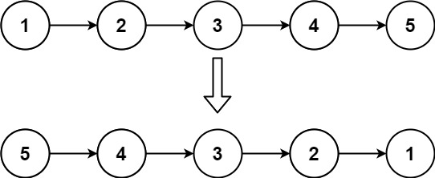
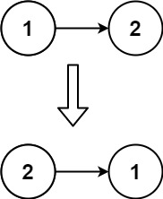

# 翻转链表
```
Given the head of a singly linked list, reverse the list, and return the reversed list.
```
 

******Example****** 1:



**Input**: `head = [1,2,3,4,5]`
**Output**: `[5,4,3,2,1]`

**Example** 2:



**Input**: `head = [1,2]`
**Output**: `[2,1]`

**Example** 3:

**Input**: `head = []`
**Output**: `[]`
 

**Constraints**:

- `The number of nodes in the list is the range [0, 5000].`
- `-5000 <= Node.val <= 5000`
 

Follow up: A linked list can be reversed either iteratively or recursively. Could you implement both?

## 迭代法
```C++
/**
 * Definition for singly-linked list.
 * struct ListNode {
 *     int val;
 *     ListNode *next;
 *     ListNode() : val(0), next(nullptr) {}
 *     ListNode(int x) : val(x), next(nullptr) {}
 *     ListNode(int x, ListNode *next) : val(x), next(next) {}
 * };
 */
class Solution {
public:
    ListNode* reverseList(ListNode* head) {
        ListNode* previousNode{nullptr};
        ListNode* oldNext{nullptr};
        while(head!=nullptr){
            oldNext = head->next;
            head->next = previousNode;
            previousNode = head;
            head = oldNext;
        }
        return previousNode;
    }
};
```
### 评估
时间复杂度 O(n)
空间复杂度 O(1)

### 知识点

## 递归法
```C++
/**
 * Definition for singly-linked list.
 * struct ListNode {
 *     int val;
 *     ListNode *next;
 *     ListNode() : val(0), next(nullptr) {}
 *     ListNode(int x) : val(x), next(nullptr) {}
 *     ListNode(int x, ListNode *next) : val(x), next(next) {}
 * };
 */
class Solution {
public:
    ListNode* reverseList(ListNode* head) {
        return reverseListCore(head, nullptr);
    }
    ListNode* reverseListCore(ListNode* current, ListNode* previous){
        // end condition
        if(current == nullptr){
            return previous;
        }
        auto oldNext{current->next};
        current->next = previous;
        // main body
        return reverseListCore(oldNext, current);
    }
};
```

### 评估
时间复杂度 O(n)
空间复杂度 O(n)

### 知识点