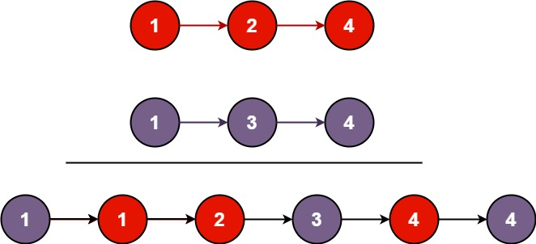

# 合并两个有序链表
```
You are given the heads of two sorted linked lists list1 and list2.

Merge the two lists into one sorted list. The list should be made by splicing together the nodes of the first two lists.

Return the head of the merged linked list.
```

 

**Example** 1:



**Input**: `list1 = [1,2,4], list2 = [1,3,4]`
**Output**: `[1,1,2,3,4,4]`

**Example** 2:

**Input**: `list1 = [], list2 = []`
**Output**: `[]`

**Example** 3:

**Input**: `list1 = [], list2 = [0]`
**Output**: `[0]`
 

**Constraints**:

- `The number of nodes in both lists is in the range [0, 50].`
- `-100 <= Node.val <= 100`
- `Both list1 and list2 are sorted in non-decreasing order.`

## 迭代写法
```C++
/**
 * Definition for singly-linked list.
 * struct ListNode {
 *     int val;
 *     ListNode *next;
 *     ListNode() : val(0), next(nullptr) {}
 *     ListNode(int x) : val(x), next(nullptr) {}
 *     ListNode(int x, ListNode *next) : val(x), next(next) {}
 * };
 */
class Solution {
public:
    ListNode* mergeTwoLists(ListNode* list1, ListNode* list2) {
        if (list1 == nullptr) {
            return list2;
        }
        if (list2 == nullptr) {
            return list1;
        }
        auto head1{list1};
        auto head2{list2};
        ListNode* preHead{nullptr};
        if (head1->val <= head2->val) {
            preHead = head1;
            head1 = head1->next;
        } else {
            preHead = head2;
            head2 = head2->next;
        }

        while (head1 != nullptr || head2 != nullptr) {
            if (head2 == nullptr) {
                preHead->next = head1;
                head1 = head1->next;
                preHead = preHead->next;
                continue;
            }
            if (head1 == nullptr) {
                preHead->next = head2;
                head2 = head2->next;
                preHead = preHead->next;
                continue;
            }
            if (head1->val <= head2->val) {
                preHead->next = head1;
                head1 = head1->next;
                preHead = preHead->next;
            } else {
                preHead->next = head2;
                head2 = head2->next;
                preHead = preHead->next;
            }
        }
        return list1->val <= list2->val ? list1 : list2;
    }
};
```
descriptionAAA
### 评估
时间复杂度 **O(m+n)**

空间复杂度 **O(1)**

### 知识点

### 优化
```C++
/**
 * Definition for singly-linked list.
 * struct ListNode {
 *     int val;
 *     ListNode *next;
 *     ListNode() : val(0), next(nullptr) {}
 *     ListNode(int x) : val(x), next(nullptr) {}
 *     ListNode(int x, ListNode *next) : val(x), next(next) {}
 * };
 */
class Solution {
public:
    ListNode* mergeTwoLists(ListNode* list1, ListNode* list2) {
        if(list1==nullptr){
            return list2;
        }
        if(list2 == nullptr){
            return list1;
        }
        auto head1{list1};
        auto head2{list2};
        ListNode* preHead{nullptr};
        if (head1->val <= head2->val) {
            preHead = head1;
            head1 = head1->next;
        } else {
            preHead = head2;
            head2 = head2->next;
        }

        while (head1 != nullptr && head2 != nullptr) {
            if (head1->val <= head2->val) {
                preHead->next = head1;
                head1 = head1->next;
            } else {
                preHead->next = head2;
                head2 = head2->next;
            }
            preHead = preHead->next;
        }
        preHead->next = head1 == nullptr ? head2 : head1;
        return list1->val <= list2->val ? list1 : list2;
    }
};
```
将最后的节点放到外面处理.
标准题解中的答案为
```C++
class Solution {
public:
    ListNode* mergeTwoLists(ListNode* l1, ListNode* l2) {
        ListNode* preHead = new ListNode(-1);

        ListNode* prev = preHead;
        while (l1 != nullptr && l2 != nullptr) {
            if (l1->val < l2->val) {
                prev->next = l1;
                l1 = l1->next;
            } else {
                prev->next = l2;
                l2 = l2->next;
            }
            prev = prev->next;
        }

        // 合并后 l1 和 l2 最多只有一个还未被合并完，我们直接将链表末尾指向未合并完的链表即可
        prev->next = l1 == nullptr ? l2 : l1;

        return preHead->next;
    }
};
```
大体相同，但是更为精简，原因在于，不同于我的写法先找出preHead，其虚构了一个preHead出来，在结尾的部分直接返回preHead->next，preHead这个dummy节点本身并未参与其中去。
~~不过这个dummy节点的取值，最好是<-100，根据题解中，确实会存在比-1小的值~~ (值的大小无所谓)

新版本优化
```C++
/**
 * Definition for singly-linked list.
 * struct ListNode {
 *     int val;
 *     ListNode *next;
 *     ListNode() : val(0), next(nullptr) {}
 *     ListNode(int x) : val(x), next(nullptr) {}
 *     ListNode(int x, ListNode *next) : val(x), next(next) {}
 * };
 */
class Solution {
public:
    ListNode* mergeTwoLists(ListNode* list1, ListNode* list2) {
        auto dummyObj{ListNode(0)};
        auto dummy{&dummyObj};
        auto preNode{dummy};

        while (list1 != nullptr && list2 != nullptr) {
            if (list1->val <= list2->val) {
                preNode->next = list1;
                list1 = list1->next;
            } else {
                preNode->next = list2;
                list2 = list2->next;
            }
            preNode = preNode->next;
        }
        preNode->next = list1 == nullptr ? list2 : list1;
        return dummy->next;
    }
};
```

## 递归写法
```C++
/**
 * Definition for singly-linked list.
 * struct ListNode {
 *     int val;
 *     ListNode *next;
 *     ListNode() : val(0), next(nullptr) {}
 *     ListNode(int x) : val(x), next(nullptr) {}
 *     ListNode(int x, ListNode *next) : val(x), next(next) {}
 * };
 */
class Solution {
public:
    ListNode* mergeTwoLists(ListNode* list1, ListNode* list2) {
        if(list1==nullptr){
            return list2;
        }
        if(list2 == nullptr){
            return list1;
        }
        if(list1->val<= list2->val){
            list1->next = mergeTwoLists(list1->next, list2);
            return list1;
        }else{
            list2->next = mergeTwoLists(list1, list2->next);
            return list2;
        }
    }
};
```
### 评估
时间复杂度 **O(m+n)**

空间复杂度 **O(m+n)**

### 知识点

### 优化